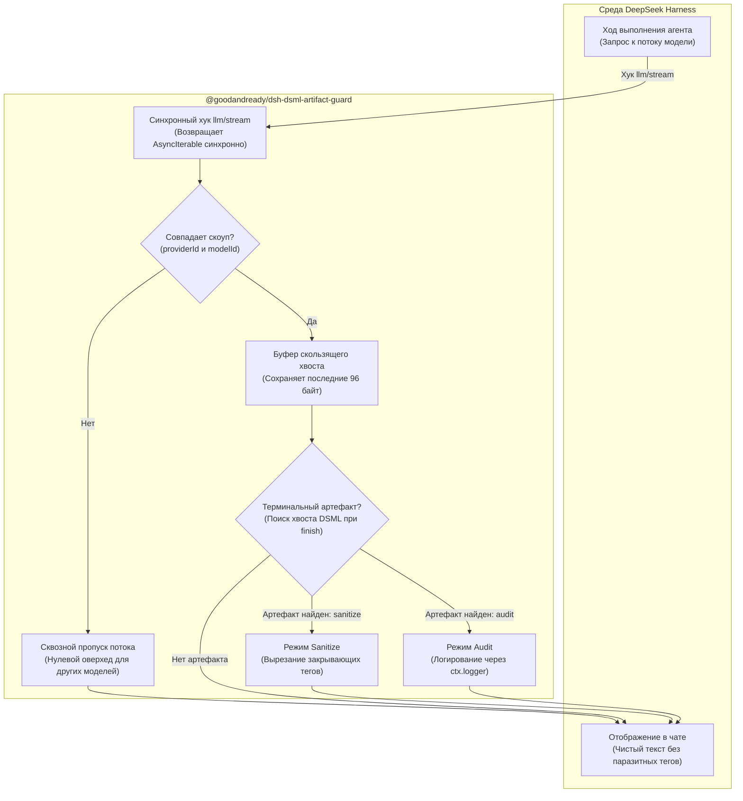

# 📦 @goodandready/dsh-dsml-artifact-guard

<div align="center">

<h3>Предохранитель и потоковый очиститель от артефактов закрывающих тегов протокола DSML в DeepSeek Harness</h3>

<p align="center">
  <a href="https://www.npmjs.com/package/@goodandready/dsh-dsml-artifact-guard"></a>
  <a href="LICENSE"></a>
  <a href="https://github.com/topics/dsh-plugin"></a>
  <a href="https://nodejs.org"></a>
</p>

<p align="center">
  <a href="https://goodandready.app/"></a>
</p>

<p align="center">
  <a href="README.md"><b>🇬🇧 English</b></a> •
  <a href="README.ru.md"><b>🇷🇺 Русский</b></a> •
  <a href="README.zh.md"><b>🇨🇳 中文说明</b></a>
</p>

<table align="center">
  <tr>
    <td align="center">
      ⭐ <strong>Если вам нравится этот плагин, поставьте ему звезду на GitHub</strong> — это покажет мне, что плагин вам полезен, и будет мотивировать меня развивать его дальше.
      <br><br>
      🐛 <strong>Если вы нашли баг или хотите предложить новый функционал</strong>, создайте issue на GitHub на любом языке — я рассмотрю ваше предложение и реализую полезные идеи в одной из следующих версий плагина.
    </td>
  </tr>
</table>

</div>

---

## ⚡ Назначение и решаемая проблема

При взаимодействии с некоторыми сторонними провайдерами моделей или прокси-шлюзами служебные теги протокола вызова инструментов DSML (DeepSeek Markup Language) могут просачиваться в видимый текстовый поток ассистента. В конце ответов пользователи нередко наблюдают протокольный мусор вида:

```text
Готово. Все тесты успешно пройдены.
</｜DSML｜parameter> </｜DSML｜invoke> </｜DSML｜tool_calls>
```

Такие теги загрязняют чат, ломают рендеринг Markdown и сбивают парсинг при копировании или передаче ответов другим агентам.

**`@goodandready/dsh-dsml-artifact-guard`** — легковесный плагин времени выполнения (host-only) для DeepSeek Harness, перехватывающий и удаляющий эти паразитные терминальные артефакты в реальном времени до того, как текст попадёт в интерфейс:

1. **Строго синхронный контракт хука**: в среде Cordis обработчик события `llm/stream` обязан синхронно возвращать итератор `AsyncIterable`. Сделать обработчик асинхронным (`async`) означает вернуть `Promise`, что неизбежно приводит к падению среды выполнения с ошибкой `stream is not async iterable`. Плагин строго соблюдает синхронный контракт.
2. **Буферизация фрагментированного хвоста**: сетевые чанки часто разрезают закрывающие теги на части. Плагин использует скользящее окно размером 96 байт (`KEEP = 96`), гарантируя надёжный захват и вырезание артефакта, даже если он разделен между пакетами.
3. **100% Fail-Open архитектура**: плагин никогда не удаляет полезный пользовательский текст или легитимные обсуждения синтаксиса DSML.
4. **Адресный скоупинг (Provider & Model)**: фильтрация применяется только к целевым провайдерам и моделям, у которых наблюдается утечка протокольных тегов. Трафик остальных моделей проходит без задержек и оверхеда.

---

## 🏗️ Архитектура работы



---

## ✨ Подробный разбор возможностей

### 1. Защита синхронного контракта Cordis
В архитектуре Cordis вызов `ctx.on('llm/stream', (o, next) => ...)` ожидает немедленный возврат асинхронного генератора. Если функция хука объявлена как `async`, JavaScript оборачивает возвращаемое значение в `Promise`. В результате потребители стрима падают с фатальной ошибкой `TypeError: stream is not async iterable`. `dsh-dsml-artifact-guard` оборачивает поток синхронно, сохраняя целостность рантайма.

### 2. Захват разорванных сетевых чанков
В реальном сетевом потоке завершающая последовательность тегов может приходить отдельными фрагментами:
* Чанк 1: `Задача выполнена. </｜DSML｜pa`
* Чанк 2: `rameter> </｜DSML｜invoke> `
* Чанк 3: `</｜DSML｜tool_calls>`

Буфер скользящего хвоста удерживает последние 96 байт до получения следующего текстового блока или сигнала завершения `finish`, точно сопоставляя полный шаблон и удаляя его как единое целое.

### 3. Гарантия сохранности данных (Fail-Open)
* Если в ответе содержится обычный текст с упоминанием тегов (например, руководство по написанию `<｜DSML｜tool_calls>`), текст **никогда** не удаляется.
* Нетекстовые чанки (`tool-call-delta`, `usage`, `finish`) пробрасываются немедленно без задержек.
* При любых непредвиденных ошибках или нестандартных форматах чанков поток не прерывается, а беспрепятственно передаётся дальше.

### 4. Режимы работы
* **`sanitize`** *(по умолчанию)*: вырезает паразитные закрывающие теги и фиксирует событие в журнале с указанием числа удалённых артефактов.
* **`audit`**: только логирует обнаружение артефактов через `ctx.logger.info(...)`, не модифицируя текст в чате.
* **`disabled`**: полностью отключает обработку.

---

## 📦 Установка

Установка через CLI DeepSeek Harness:

```bash
dsh plugin --profile web add @goodandready/dsh-dsml-artifact-guard
```

Перезапустите экземпляр DeepSeek Harness.

---

## ⚙️ Конфигурация (`settings.yaml`)

Настройка провайдера и модели в `settings.yaml` или через веб-панель управления:

```yaml
# settings.yaml
dsh-dsml-artifact-guard:
  mode: sanitize
  providerId: "your-provider-id"
  modelId: "your-model-id"
```

### Таблица параметров конфигурации

| Параметр | Тип | По умолчанию | Описание |
|:---|:---|:---|:---|
| `mode` | `string` | `"sanitize"` | Режим работы: `"sanitize"` (удалять теги), `"audit"` (только логировать) или `"disabled"` |
| `providerId` | `string` | `"opencode-go"` | Идентификатор целевого провайдера, отдающего паразитные теги |
| `modelId` | `string` | `"deepseek-v4-flash"` | Идентификатор целевой модели с артефактами |

---

## 🧪 Тестирование

Запуск автоматических тестов:

```bash
npm test
npm run check
```

---

## 📄 Лицензия

MIT © [GooDAnDReaDY](https://github.com/GooDAnDReaDY)

## Changed in v0.1.3

#8: wrap `llm/stream` in `ctx.effect` so unload unsubscribes.
#9: `cordis.patch.yml` uses `config: {}` — schema defaults (`mode: audit`, provider/model ids) apply unless overridden in host config.

## Изменения в v0.1.4

#11: значение `mode` по умолчанию в схеме переведено на `sanitize` для защиты «из коробки».
#11: балансировка открывающих и закрывающих тегов в `sanitizeDsmlArtifacts` при наличии закрытых блоков в прозе.
#11: гигиена репозитория с отслеживаемым `package-lock.json` и дизайн-контрактом.

## Изменения в v0.1.5

#15: исправлен синтаксис стрелок диаграммы Mermaid на GitHub и добавлен обязательный блок поддержки репозитория.

## Изменения в v0.2.0

- #17: Нативная карточка настроек в слоте settings.plugin.item со статусом снимка, формой и предупреждением об отключении.
- #18: Модуль автообновления в 1 клик с эндпоинтом /api/dsh-dsml-artifact-guard/update, сравнением версий и защитой same-origin/loopback.
- #19: Санитайзинг репозитория от внутреннего AGENTS.md и обновление .gitignore.
- #20: Оптимизация состава npm-пакета, удаление дубликатов README и сокращение размера пакета на ~40%.
- #21: Очистка дерева исходников от архивных пакетов .tgz.
